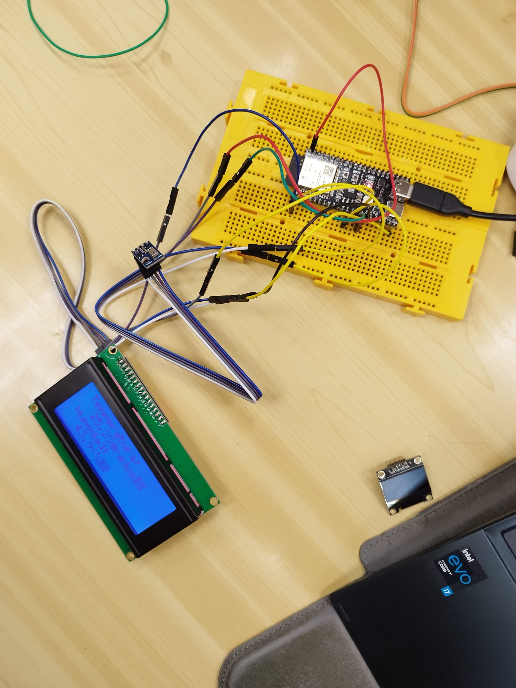

# Ejercicio práctico 1 Escáner I2C

###  Código 1
```cpp
#include <Arduino.h>
#include <Wire.h>
void setup()
{
 Wire.begin();
 Serial.begin(115200);
 while (!Serial); // Leonardo: wait for serial monitor
 Serial.println("\nI2C Scanner");
}
void loop()
{
 byte error, address;
 int nDevices;
 Serial.println("Scanning...");
 nDevices = 0;
 for(address = 1; address < 127; address++ )
 {
 // The i2c_scanner uses the return value of
 // the Write.endTransmisstion to see if
 // a device did acknowledge to the address.
 Wire.beginTransmission(address);
 error = Wire.endTransmission();
 if (error == 0)
 {
 Serial.print("I2C device found at address 0x");
 if (address<16)
 Serial.print("0");
 Serial.print(address,HEX);
 Serial.println(" !");
 nDevices++;
 }
 else if (error==4)
 {
 Serial.print("Unknown error at address 0x");
 if (address<16)
 Serial.print("0");
 Serial.println(address,HEX);
 } 
 }
 if (nDevices == 0)
 Serial.println("No I2C devices found\n");
 else
 Serial.println("done\n");
 delay(5000); // wait 5 seconds for next scan
}
```

### Slida por puerto serie
Una vez compila el código lo primero en aparecer en el puerto serie es:
```
I2C Scanner
Scanning...
```
A continuación en función de se hay algun dispositivo I2C conectado o no habrá diferentes salidas.
- No hay ningún I2C conectado:
```
No I2C devices found
```
- Hay algun I2C conectado:
```
I2C device found at address 0x
```
Y justo después muestra en sistema hexadecimal la dirección a la que esta conectado el I2C.

# Ejercicio práctico 2

### Foto del montaje



### Salidas de depuración(print...)
Iniciar la comunicación serial: `Adafruit AHT10/AHT20 demo!`

En la inicialización del sensor hay dos salidas en función de si se encuentra o no el sensor AHT10 o AHT20. Estos son respectivamente:
`Could not find AHT? Check wiring` y `AHT10 or AHT20 found`.

Finalmente, en el bucle principal, se muestra por la pantalla LCD la lectura de los datos del sensor. 
`Temperatura: xx.x grados` y `Humedad: xx.x%`.

### Código generado

```cpp
#include <Arduino.h>
//YWROBOT
//Compatible with the Arduino IDE 1.0
//Library version:1.1
#include <LiquidCrystal_I2C.h>

#include <Adafruit_AHTX0.h>

Adafruit_AHTX0 aht;
LiquidCrystal_I2C lcd(0x27,20,4);  // set the LCD address to 0x27 for a 16 chars and 2 line display

void setup()
{
  Serial.begin(115200);
  lcd.init();                      // initialize the lcd 
  Serial.println("Adafruit AHT10/AHT20 demo!");

  if (! aht.begin()) {
    Serial.println("Could not find AHT? Check wiring");
    while (1) delay(10);
  }
  Serial.println("AHT10 or AHT20 found");
}


void loop() {
  sensors_event_t humidity, temp;
  aht.getEvent(&humidity, &temp);// populate temp and humidity objects with fresh data
    // Print a message to the LCD.
  lcd.backlight();
  lcd.setCursor(1,0);
  lcd.print("Temperatura: "); 
  lcd.setCursor(3,1);
  lcd.print(temp.temperature); 
  lcd.println(" grados");
  lcd.setCursor(1,2);
  lcd.print("Humedad: "); 
  lcd.setCursor(3,3);
  lcd.print(humidity.relative_humidity); 
  lcd.println("%");
  delay (1000);
}
```

### Explicación del códgio

Este código inicializa y configura un sensor de temperatura y humedad AHT10/AHT20 y una pantalla LCD I2C. En cada iteración del bucle principal, el código lee los datos de temperatura y humedad del sensor, los muestra en la pantalla LCD y espera 1 segundo antes de repetir el proceso. La comunicación serie se utiliza para imprimir mensajes de depuración que ayudan a verificar si el sensor se ha inicializado correctamente y si la lectura de datos está funcionando.

#### Librerías

```cpp
#include <Arduino.h>
#include <LiquidCrystal_I2C.h>
#include <Adafruit_AHTX0.h>
```
- `#include <LiquidCrystal_I2C.h>`: Biblioteca para manejar pantallas LCD conectadas a través de I2C.
- `#include <Adafruit_AHTX0.h>`: Biblioteca para manejar el sensor de temperatura y humedad AHT10/AHT20.

#### Declaración de Objetos

```cpp
Adafruit_AHTX0 aht;
LiquidCrystal_I2C lcd(0x27, 20, 4);  // dirección I2C del LCD y tamaño 20x4
```

- `Adafruit_AHTX0 aht;`: Declara un objeto `aht` de la clase `Adafruit_AHTX0` para interactuar con el sensor AHT10/AHT20.
- `LiquidCrystal_I2C lcd(0x27, 20, 4);`: Declara un objeto `lcd` de la clase `LiquidCrystal_I2C` con la dirección I2C `0x27` y un tamaño de 20 columnas y 4 filas.

#### Configuración Inicial

```cpp
void setup() {
  Serial.begin(115200);
  lcd.init();  // inicializa la pantalla LCD
  Serial.println("Adafruit AHT10/AHT20 demo!");

  if (!aht.begin()) {
    Serial.println("Could not find AHT? Check wiring");
    while (1) delay(10);
  }
  Serial.println("AHT10 or AHT20 found");
}
```

- `Serial.begin(115200);`: Inicia la comunicación serie a 115200 baudios para depuración.
- `lcd.init();`: Inicializa la pantalla LCD.
- `Serial.println("Adafruit AHT10/AHT20 demo!");`: Imprime un mensaje de inicio en el monitor serie.
- `if (!aht.begin()) {...}`: Intenta iniciar el sensor AHT10/AHT20. Si no se encuentra el sensor, imprime un mensaje de error y entra en un bucle infinito.
- `Serial.println("AHT10 or AHT20 found");`: Si el sensor se inicializa correctamente, imprime un mensaje de éxito.

#### Bucle Principal

```cpp
void loop() {
  sensors_event_t humidity, temp;
  aht.getEvent(&humidity, &temp);  // obtiene los datos de temperatura y humedad

  // Enciende la retroiluminación del LCD
  lcd.backlight();

  // Muestra la temperatura en la pantalla LCD
  lcd.setCursor(1, 0);
  lcd.print("Temperatura: ");
  lcd.setCursor(3, 1);
  lcd.print(temp.temperature);
  lcd.print(" grados");

  // Muestra la humedad en la pantalla LCD
  lcd.setCursor(1, 2);
  lcd.print("Humedad: ");
  lcd.setCursor(3, 3);
  lcd.print(humidity.relative_humidity);
  lcd.print("%");

  delay(1000);  // espera 1 segundo antes de la próxima lectura
}
```

- `sensors_event_t humidity, temp;`: Declara dos variables para almacenar los datos de temperatura y humedad.
- `aht.getEvent(&humidity, &temp);`: Obtiene los datos de temperatura y humedad del sensor AHT10/AHT20.
- `lcd.backlight();`: Enciende la retroiluminación de la pantalla LCD.
- `lcd.setCursor(1, 0);`: Establece el cursor en la primera columna de la primera fila.
- `lcd.print("Temperatura: ");`: Imprime el texto "Temperatura: " en la primera fila.
- `lcd.setCursor(3, 1);`: Establece el cursor en la tercera columna de la segunda fila.
- `lcd.print(temp.temperature);`: Imprime el valor de la temperatura.
- `lcd.print(" grados");`: Imprime el texto " grados" después del valor de la temperatura.
- `lcd.setCursor(1, 2);`: Establece el cursor en la primera columna de la tercera fila.
- `lcd.print("Humedad: ");`: Imprime el texto "Humedad: " en la tercera fila.
- `lcd.setCursor(3, 3);`: Establece el cursor en la tercera columna de la cuarta fila.
- `lcd.print(humidity.relative_humidity);`: Imprime el valor de la humedad relativa.
- `lcd.print("%");`: Imprime el símbolo de porcentaje "%" después del valor de la humedad.
- `delay(1000);`: Espera 1 segundo antes de la próxima iteración del bucle.
